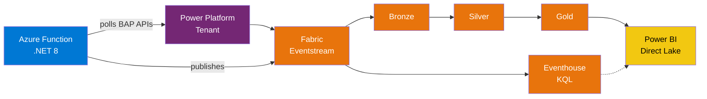
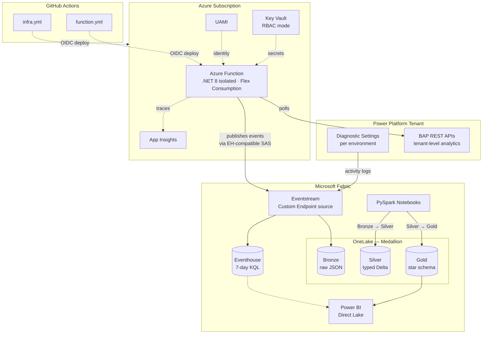

# Power Platform Telemetry Pipeline on Microsoft Fabric



A production-grade reference implementation that consolidates all Power Platform
telemetry into a **Microsoft Fabric medallion lakehouse** with a Direct Lake
Power BI model, sub-second KQL queries, and 8 base KPIs. An Azure Function
(.NET 8 isolated) polls BAP REST APIs and publishes directly to a Fabric
Eventstream Custom Endpoint. Diagnostic settings stream per-environment activity
to the same Eventstream. Infrastructure is deployed via Bicep and GitHub Actions
with OIDC workload identity federation.

## Purpose

Show how to build, deploy, and operate a real telemetry pipeline for Power Platform
at enterprise scale — using Azure-native services for full control, custom
enrichment, and CI/CD — so any **Center of Excellence** can answer governance,
adoption, and operations questions across time, environments, and business units.

## Objectives

1. **Consolidate all signals.** Diagnostic settings stream Dataverse, Power Apps,
   Power Automate, and Copilot Studio activity to a Fabric Eventstream. An Azure
   Function polls BAP REST APIs for tenant-level metrics not available in
   diagnostics (license usage, environment lifecycle) and publishes to the same
   Eventstream via its Event Hub-compatible Custom Endpoint.
2. **Land in Fabric.** Eventstream → Bronze Lakehouse (raw JSON) → Silver (typed
   Delta) → Gold (star schema) → Power BI Direct Lake. A parallel Eventhouse
   provides a 7-day hot window for sub-second KQL queries.
3. **Use real Azure end-to-end, no fictional CLIs.** Provision with Bicep, deploy
   with `func azure functionapp publish`, wire Fabric manually, verify with
   App Insights and KQL — all documented step-by-step.
4. **Ship 8 base KPIs.** Adoption Index, Maker Productivity, Reliability,
   Cost-to-Serve, Risk Posture, Security & Compliance, Business Value,
   Sustainability. Verticals extend but never replace.
5. **Full IaC + CI/CD.** Bicep for infrastructure, GitHub Actions for build and
   deploy, OIDC workload identity federation — no long-lived secrets.

## The pipeline

| # | Component | What it does |
|---|---|---|
| 1 | **Diagnostic Settings** | Streams per-environment activity (Dataverse, Apps, Flows, Copilot Studio) to the Eventstream |
| 2 | **Azure Function** (.NET 8 isolated, Flex Consumption) | Polls BAP REST APIs — `PollLicenseUsage` every 15 min, `PollEnvironmentLifecycle` hourly — publishes to Eventstream Custom Endpoint |
| 3 | **Key Vault** (RBAC mode) | Stores Eventstream SAS connection string and app registration secret; Function reads via `@Microsoft.KeyVault(...)` references |
| 4 | **Fabric Eventstream** (Custom Endpoint source) | Receives events from both diagnostic settings and the Azure Function, fans out to Bronze Lakehouse (Delta) + Eventhouse (KQL) |
| 5 | **Bronze → Silver → Gold notebooks** | PySpark medallion: parse → type-cast → dedupe → star schema (dim/fact tables) |
| 6 | **Eventhouse** (KQL) | 7-day hot window for sub-second incident queries and live dashboards |
| 7 | **Power BI Direct Lake** | Semantic model over Gold tables — reads Delta directly from OneLake, 30+ DAX measures |

## Data flow



| Control | Implementation |
|---|---|
| **Identity** | User-Assigned Managed Identity (UAMI) for Function; Entra ID app registration for BAP API |
| **Secrets** | Key Vault (RBAC mode) — Function reads via `@Microsoft.KeyVault(...)` references |
| **Network** | Private endpoints recommended for production (Storage, Event Hubs, Key Vault) |
| **CI/CD** | OIDC workload identity federation — no long-lived secrets in GitHub |

## The 8 base KPIs

Every deployment ships these — verticals extend but never replace them.

| Tier | # | KPI | Definition |
|---|---|---|---|
| **1** | 1 | **Adoption Index** | MAU ÷ licensed users, trended monthly |
| **1** | 2 | **Maker Productivity** | Apps + flows shipped per maker per quarter |
| **1** | 3 | **Reliability** | Error rate %, p95 flow duration, SLA breaches |
| **1** | 4 | **Cost-to-Serve** | Capacity consumption per BU |
| **1** | 5 | **Risk Posture** | Unowned apps, high-impact connectors, policy violations |
| **2** | 6 | **Security & Compliance** | DLP violations, connector risk, audit completeness |
| **2** | 7 | **Business Value** | Hours saved × labor rate, ROI pipeline |
| **2** | 8 | **Sustainability** | Estimated kgCO₂e per workload |

## Industry use cases

The pipeline is industry-agnostic — every KPI applies across sectors. Each vertical
adds **Tier-3 KPIs, regulatory tags, and alert rules** through a clean extension
surface.

### Financial Services — SOX, MAR, PCI-DSS

A global bank's CoE runs 2,400+ Power Apps and 8,000 flows across trading,
back-office, and wealth management. Tier-3 KPIs: SoD Violation Rate, App SOX
Classification Coverage, High-Risk Connector Attestation %, Audit Retention
Compliance. Full lens: [docs/verticals/financial-services.md](./docs/verticals/financial-services.md).

### Healthcare & Life Sciences — HIPAA, 21 CFR Part 11, GDPR

A hospital system uses Power Apps for patient intake, Power Automate for lab-result
routing, and Copilot Studio for triage bots. Tier-3 KPIs: PHI Exposure Rate,
Copilot Transcript Redaction %, GxP Signature Coverage, HIPAA Breach Readiness
Index. Full lens: [docs/verticals/healthcare.md](./docs/verticals/healthcare.md).

### Retail & CPG — PCI-DSS, CCPA, PSD2

A 3,000-store retailer deploys Power Apps for in-store inventory and Copilot Studio
for customer service. Tier-3 KPIs: Store-Level MAU %, Seasonal Capacity Headroom,
Supplier Portal SLA %, PCI-Scoped App Coverage. Full lens: [docs/verticals/retail.md](./docs/verticals/retail.md).

### Manufacturing — ITAR, ISO 9001, IEC 62443

An industrial conglomerate runs Power Apps on shop-floor tablets for quality
inspections. Tier-3 KPIs: Shop-Floor App Uptime %, OEE Correlation Score, EDI Flow
Reliability, ITAR-Boundary Breach Count. Full lens: [docs/verticals/manufacturing.md](./docs/verticals/manufacturing.md).

### Public Sector — FedRAMP, DoD IL, CJIS, Section 508

A federal agency deploys Power Apps for case management and Copilot Studio for
citizen-facing FAQ bots. Tier-3 KPIs: Boundary Tag Coverage %, WCAG Accessibility
Score, Mission-Tier SLA Compliance, FOIA Response Readiness. Full lens: [docs/verticals/public-sector.md](./docs/verticals/public-sector.md).

### Energy & Utilities — NERC CIP, NIS2, REMIT, EPA

An energy company uses Power Apps for field-worker inspections and Power Automate
for SCADA event routing. Tier-3 KPIs: Field-Worker App Uptime %, NERC CIP Flow
Coverage, Asset Data Lineage Score, Emissions per Workload (Scope 2). Full lens: [docs/verticals/energy.md](./docs/verticals/energy.md).

### Pattern: how to adapt the pipeline to a new vertical

1. Copy [docs/verticals/_template.md](./docs/verticals/_template.md) and define Tier-3 KPIs.
2. Add the corresponding DAX measures to `notebooks/measures.dax`.
3. Add vertical-specific alert rules to the Gold quality-check notebook.

## Quick start

Prerequisites: Azure CLI, .NET 8 SDK, Azure Functions Core Tools v4, Python 3.11+,
a Fabric capacity (F2+ or trial), and an Entra ID app registration — see [docs/prerequisites.md](./docs/prerequisites.md) and [docs/app-registration.md](./docs/app-registration.md).

```powershell
# 1. Deploy Azure infrastructure (Event Hubs, Function App, Key Vault, UAMI, RBAC)
az login
az group create -n rg-pp-telemetry-lab -l eastus2
az deployment group create -g rg-pp-telemetry-lab \
  --template-file infra/bicep/main.bicep \
  --parameters infra/bicep/main.bicepparam

# 2. Store secrets in Key Vault
az keyvault secret set --vault-name <kv-name> --name pp-tenant-sp-secret --value "<secret>"
az keyvault secret set --vault-name <kv-name> --name fabric-eventstream-cs --value "<cs>"

# 3. Configure and deploy the Azure Function
az functionapp config appsettings set -n <func-name> -g rg-pp-telemetry-lab --settings \
  PP_TENANT_ID="<tenant>" PP_CLIENT_ID="<client>" PP_CLIENT_SECRET_NAME="pp-tenant-sp-secret" \
  EVENTHUB_CONNECTION_STRING="@Microsoft.KeyVault(SecretUri=https://<kv>.vault.azure.net/secrets/fabric-eventstream-cs/)"

cd src/functions/PpTelemetryForwarder
dotnet publish -c Release
func azure functionapp publish <func-name> --dotnet-isolated

# 4. Wire Fabric (manual): Workspace → Lakehouse × 3 → Eventhouse → Eventstream
#    See lab/README.md Step 5 for detailed portal steps.

# 5. Verify data flow
az monitor app-insights query --app <ai-name> -g rg-pp-telemetry-lab \
  --analytics-query "traces | where timestamp > ago(30m) | where message has 'Published' | take 10"
```

Full step-by-step walkthrough (~4 hours): [lab/README.md](./lab/).

## Repository layout

```
powerplatform-telemetry-fabric-lab/
  .github/
    workflows/
      infra.yml                      Bicep validate → what-if → deploy (OIDC)
      function.yml                   .NET build → func publish (OIDC)
    ISSUE_TEMPLATE/                  Bug report + feature request
    pull_request_template.md
  architecture/
    procode-architecture.drawio      draw.io diagrams (editable in VS Code)
    procode-stencils.drawio
  docs/
    app-registration.md              Entra ID app reg + BAP management app
    architecture.md                  Architecture deep dive
    business-use-case.md             Canonical use case & personas
    glossary.md                      BAP, CoE Kit, Direct Lake, etc.
    prerequisites.md                 Licensing, identities, Azure resources
    QUICKSTART.md                    15-minute quick path
    verticals/                       6 industry lenses + template
  fabric/
    kql/sample-queries.kql           10 ready-to-run KQL queries
    kql/setup_silver_gold.ps1        Creates Silver/Gold KQL tables
    kql/verify.ps1                   Verification script
    notebooks/pp_inspect_bronze.ipynb
  infra/bicep/
    main.bicep                       Full IaC: Function, KV, UAMI, RBAC, App Insights, Storage
    main.bicepparam                  Parameter file
  lab/
    README.md                        Full lab walkthrough (10 steps, ~4 h)
  notebooks/
    01_bronze_to_silver.py           Parse JSON, type-cast, dedupe → Silver
    02_silver_to_gold.py             Star schema dim/fact → Gold
    03_gold_quality_checks.py        Data quality harness
    measures.dax                     30+ DAX measures for Direct Lake
    README.md                        Scheduling guide
  scripts/
    update-eventstream-secret.ps1    Key Vault secret rotation helper
  src/functions/PpTelemetryForwarder/
    BapClient.cs                     BAP REST API auth + calls
    TenantTelemetryFunction.cs       Timer triggers (15 min + hourly)
    EventHubPublisher.cs             Event Hub producer
    DiagnosticFunction.cs            Health check endpoint
    Program.cs                       DI + host builder
    host.json / .csproj
  CONTRIBUTING.md
  LICENSE
  SECURITY.md
```

## Sample KQL queries

```kusto
// Environment inventory
environment_inventory
| project displayName, environmentSku, location, provisioningState
| order by displayName

// Error rate by app (last 7 days)
pp_telemetry_raw
| where eventType == "pp.app.telemetry"
| extend data = parse_json(payload_json)
| summarize errors = countif(tolong(data.errorCount) > 0), total = count()
  by app = tostring(data.appName), bin(timestamp, 1d)
| extend error_rate = round(100.0 * errors / total, 1)
| order by error_rate desc

// License usage trend
pp_telemetry_raw
| where eventType == "pp.tenant.licenseUsage"
| extend data = parse_json(payload_json)
| project timestamp, sku = tostring(data.skuName),
  assigned = toint(data.assignedUnits), consumed = toint(data.consumedUnits)
| order by timestamp desc
```

## License

See [LICENSE](./LICENSE).
