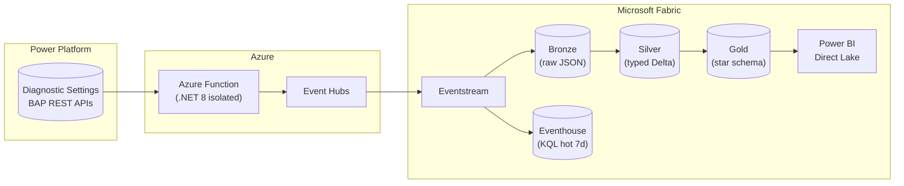

# Power Platform Adoption & Operations Intelligence (PPAOI)

[](https://github.com/Vaddify/powerplatform-telemetry-fabric-lab/actions/workflows/infra.yml)
[](https://github.com/Vaddify/powerplatform-telemetry-fabric-lab/actions/workflows/function.yml)
[](./LICENSE)

> A production-ready, vertical-agnostic blueprint that gives any **Power Platform Center of Excellence** a single, historical, queryable view of how the citizen-developed estate is **built, used, and trusted** — landed in Microsoft Fabric, surfaced in Power BI.

---

## The problem

Every organization scaling Power Platform faces the same gap:

> Telemetry is scattered across Application Insights, Dataverse, the CoE Kit, the Power Platform Admin Center, and the BAP REST APIs. Each source has its own retention window (7–30 days), its own schema, and its own access model. **The CoE cannot answer basic governance questions across time, environments, and business units.**

This lab solves it by consolidating all Power Platform signals into a **Microsoft Fabric medallion lakehouse** with 8 base KPIs, a Direct Lake Power BI model, and per-vertical extension points — all deployable in a day.

## The use case — meet the CoE team

> **Scenario**: A mid-to-large enterprise has adopted Power Platform across 12 business units, with 300+ makers building canvas apps, cloud flows, Copilot Studio agents, and model-driven apps across 40+ environments. The **Center of Excellence (CoE)** is accountable for governing, operating, and growing this estate — but today it's flying blind.

### What the CoE is responsible for

The CoE exists to run Power Platform as an internal product. It owns three mandates:

| Mandate | What it means | The gap today |
|---|---|---|
| **Govern** | Policy, DLP, security, compliance, lifecycle management | Diagnostic data expires in 7–28 days. The CoE Kit shows current state but not history. An unmanaged flow connecting a sandbox to a production SQL database can go undetected for weeks — auditors flag it as a material control weakness. |
| **Operate** | Reliability, capacity, cost, incident response | Troubleshooting requires cross-referencing App Insights (if wired), Admin Center analytics (7-day window), and the CoE Kit (eventually consistent). Incident MTTR is hours, not minutes. Capacity planning is guesswork. |
| **Grow** | Adoption, maker enablement, business value, executive reporting | Monthly reporting requires manual CSV pulls from multiple portals, stitched together in a deck. *"How many MAU do we have, year-over-year?"* takes a week to answer. *"Is this platform paying for itself?"* gets anecdotes, not numbers. |

### What PPAOI gives each CoE function

| CoE function | KPIs delivered | What changes |
|---|---|---|
| **Platform ownership** | Adoption Index (MAU ÷ licensed users), Business Value (hours saved × labor rate), Cost-to-Serve (capacity per BU) | Live Power BI dashboard, refreshed hourly, trended over years, sliceable by BU. The monthly deck that took a week now builds itself. |
| **Governance & compliance** | Risk Posture (unowned apps, high-impact connectors, policy violations), Security & Compliance (DLP violations, audit completeness, isolation breaches) | Proactive alerts: *"Flow in Production references SQL connector and was modified by a user outside the approved security group — flag for SoD review."* Historical audit trail retained for years, not days. |
| **Maker enablement** | Maker Productivity (apps + flows shipped per maker per quarter), Active Makers trending, Reliability (error rate per app) | Target coaching where it matters: identify stuck makers, celebrate top performers, and measure training ROI with actual production telemetry — not surveys. |
| **Platform SRE / operations** | Reliability (p95 flow duration, error rate %, SLA breaches), streaming diagnostics | 7-day hot window in Eventhouse (KQL) for sub-second incident queries. Correlate failures across apps, flows, and environments in one place instead of five disconnected tools. |

---

> **The outcome**: After deploying PPAOI, the CoE can answer [all 12 governance questions](./docs/business-use-case.md#6-success-criteria) in under 30 seconds using a single Power BI workspace app, with data no older than 24 hours.

### Who else consumes the dashboards

The CoE builds it; these stakeholders consume the same underlying dataset through scoped views:

| Stakeholder | What they see |
|---|---|
| **BU Sponsor** | Adoption + Business Value scoped to their unit — *"Is my investment paying off?"* |
| **Risk / Compliance Officer** | Risk Posture + Audit trail — *"Are regulated workloads correctly classified?"* |
| **Finance / FinOps** | Cost & Capacity per workload — *"What is my cost-to-serve per BU?"* |
| **Maker / Citizen Dev** | Self-service app health portal — *"Are my apps healthy? Any errors to fix?"* |

## Architecture



Full architecture details: [docs/architecture.md](./docs/architecture.md) | [Glossary](./docs/glossary.md)

## The 8 Base KPIs

Every deployment ships these — verticals extend but never replace them.

| Tier | # | KPI | Definition |
|---|---|---|---|
| **1** | 1 | **Adoption Index** | MAU ÷ licensed users, trended monthly |
| **1** | 2 | **Maker Productivity** | Apps + flows shipped per maker per quarter |
| **1** | 3 | **Reliability** | Error rate %, p95 flow duration, SLA breaches |
| **1** | 4 | **Cost-to-Serve** | Capacity consumption per BU |
| **1** | 5 | **Risk Posture** | Unowned apps, high-impact connectors, policy violations |
| **2** | 6 | **Security & Compliance** | DLP violations, connector risk, audit completeness |
| **2** | 7 | **Business Value** | Hours saved × labor rate, ROI pipeline |
| **2** | 8 | **Sustainability** | Estimated kgCO₂e per workload |

## Vertical examples

The base pipeline is industry-agnostic. Each vertical adds **Tier-3 KPIs, regulatory tags, and alert rules** through a clean extension surface.

<details>
<summary><strong>Financial Services</strong> — SOX, MAR, PCI-DSS</summary>

A global bank's CoE runs 2,400+ Power Apps and 8,000 flows across trading, back-office, and wealth management. They need to prove to regulators that every production app has a change-control record, that no flow bypasses segregation-of-duties, and that all audit data is retained for 7 years.

**Tier-3 KPIs added**: SoD Violation Rate, App SOX Classification Coverage, High-Risk Connector Attestation %, Audit Retention Compliance

**Example alert**: _"Flow `Trade-Confirm-Reconciler` in the `Markets-Prod` environment references the SQL connector and was modified by a user not in the `Markets-AppDev` security group — flag for SoD review."_

Full lens: [docs/verticals/financial-services.md](./docs/verticals/financial-services.md)
</details>

<details>
<summary><strong>Healthcare & Life Sciences</strong> — HIPAA, 21 CFR Part 11, GDPR</summary>

A hospital system uses Power Apps for patient intake, Power Automate for lab-result routing, and Copilot Studio for triage bots. PHI may appear in telemetry, Copilot transcripts must be redactable, and GxP-regulated flows require electronic signatures per 21 CFR Part 11.

**Tier-3 KPIs added**: PHI Exposure Rate, Copilot Transcript Redaction %, GxP Signature Coverage, HIPAA Breach Readiness Index

**Example alert**: _"Copilot agent `PatientTriageBot` in `ClinicalOps-Prod` logged 14 messages containing tokens matching PHI patterns (MRN, SSN) in the last 24 hours — trigger data-loss incident review."_

Full lens: [docs/verticals/healthcare.md](./docs/verticals/healthcare.md)
</details>

<details>
<summary><strong>Retail & CPG</strong> — PCI-DSS, CCPA, PSD2</summary>

A 3,000-store retailer deploys Power Apps for in-store inventory checks, Power Automate for supplier EDI, and Copilot Studio for customer service bots. Adoption varies wildly by region and spikes during holiday seasons, requiring capacity forecasting.

**Tier-3 KPIs added**: Store-Level MAU %, Seasonal Capacity Headroom, Supplier Portal SLA %, PCI-Scoped App Coverage

**Example alert**: _"Store group `APAC-Tier1` adoption dropped below 40% MAU for the second consecutive month — route to Regional Maker Lead for enablement intervention."_

Full lens: [docs/verticals/retail.md](./docs/verticals/retail.md)
</details>

<details>
<summary><strong>Manufacturing</strong> — ITAR, ISO 9001, IEC 62443</summary>

An industrial conglomerate runs Power Apps on shop-floor tablets for quality inspections, Power Automate for MES/ERP integration, and Copilot Studio for maintenance assistants. OT/IT boundary enforcement and downtime correlation are critical.

**Tier-3 KPIs added**: Shop-Floor App Uptime %, OEE Correlation Score, EDI Flow Reliability, ITAR-Boundary Breach Count

**Example alert**: _"Flow `MES-SAP-OrderSync` p95 latency exceeded 45 s in `Plant-DE-03` — correlates with 12% OEE drop on Line 7; escalate to OT team."_

Full lens: [docs/verticals/manufacturing.md](./docs/verticals/manufacturing.md)
</details>

<details>
<summary><strong>Public Sector</strong> — FedRAMP, DoD IL, CJIS, Section 508</summary>

A federal agency deploys Power Apps for case management, Power Automate for inter-agency data exchange, and Copilot Studio for citizen-facing FAQ bots. All assets must be tagged to their authorization boundary (FedRAMP/IL level), and FOIA-responsive data must be cataloged.

**Tier-3 KPIs added**: Boundary Tag Coverage %, WCAG Accessibility Score, Mission-Tier SLA Compliance, FOIA Response Readiness

**Example alert**: _"3 Power Apps in the `CJ-Prod-IL5` environment are missing FedRAMP boundary tags — block promotion to production per ATO policy."_

Full lens: [docs/verticals/public-sector.md](./docs/verticals/public-sector.md)
</details>

<details>
<summary><strong>Energy & Utilities</strong> — NERC CIP, NIS2, REMIT, EPA</summary>

An energy company uses Power Apps for field-worker inspections, Power Automate for SCADA event routing, and Copilot Studio for safety-procedure lookup. NERC CIP requires that any flow touching bulk electric system data is inventoried and auditable.

**Tier-3 KPIs added**: Field-Worker App Uptime %, NERC CIP Flow Coverage, Asset Data Lineage Score, Emissions per Workload (Scope 2)

**Example alert**: _"Flow `SCADA-EventRouter` in `GridOps-Prod` was modified without a corresponding change-request in ServiceNow — NERC CIP violation flagged."_

Full lens: [docs/verticals/energy.md](./docs/verticals/energy.md)
</details>

<br/>

Add your own vertical by copying [docs/verticals/_template.md](./docs/verticals/_template.md).

## Repo layout

```
.
├── docs/
│   ├── business-use-case.md      ← canonical use case & personas (read first)
│   ├── architecture.md           ← architecture deep dive
│   ├── prerequisites.md          ← licensing, identities, Azure resources
│   ├── glossary.md               ← BAP, CoE Kit, Direct Lake, etc.
│   └── verticals/                ← 6 industry lenses + template
├── architecture/                 ← draw.io diagrams
├── lab/                          ← Lab walkthrough (~4 h)
├── infra/bicep/                  ← IaC: Event Hubs, Functions, KV, UAMI, RBAC
├── src/functions/                ← .NET 8 telemetry forwarder (BAP API → Event Hubs)
├── fabric/kql/                   ← Eventhouse setup scripts + KQL queries
├── notebooks/                    ← PySpark medallion + DAX measures
├── scripts/                      ← Operational helpers
└── .github/workflows/            ← CI/CD with OIDC workload identity
```

## Getting started

### Quick path (15 minutes)

See [docs/QUICKSTART.md](./docs/QUICKSTART.md) — deploy the infrastructure, trigger one polling cycle, and see data land in Fabric.

### Full lab path

1. **Read** [docs/business-use-case.md](./docs/business-use-case.md) — confirm the use case, pick your vertical lens.
2. **Provision** the items in [docs/prerequisites.md](./docs/prerequisites.md).
3. **Run the lab** — Follow [lab/](./lab/) to deploy the pipeline, wire Fabric, run medallion notebooks, and build the Power BI model (~4 h).
4. **Extend** — Add your vertical KPIs from `docs/verticals/<industry>.md` to `notebooks/measures.dax`.

## Sample KQL queries (Eventhouse)

```kusto
// Environment inventory — live snapshot from BAP API
environment_inventory
| project displayName, environmentSku, location, provisioningState, version
| order by displayName

// Error rate by app over the last 7 days
pp_telemetry_raw
| where eventType == "pp.app.telemetry"
| extend data = parse_json(payload_json)
| summarize errors = countif(tolong(data.errorCount) > 0),
            total = count()
            by app = tostring(data.appName), bin(timestamp, 1d)
| extend error_rate = round(100.0 * errors / total, 1)
| order by error_rate desc

// License usage trend
pp_telemetry_raw
| where eventType == "pp.tenant.licenseUsage"
| extend data = parse_json(payload_json)
| project timestamp, sku = tostring(data.skuName), assigned = toint(data.assignedUnits), consumed = toint(data.consumedUnits)
| order by timestamp desc
```

## Tech stack

| Layer | Technology |
|---|---|
| **Ingestion** | Azure Event Hubs, Fabric Eventstream |
| **Compute** | Azure Functions (.NET 8 isolated, Flex Consumption) |
| **Storage** | OneLake (Delta/Parquet), Eventhouse (KQL) |
| **Transform** | PySpark notebooks (medallion), KQL update policies |
| **Serving** | Power BI Direct Lake, KQL dashboards |
| **Security** | Managed Identity (UAMI), Key Vault (RBAC), OIDC federation |
| **IaC** | Bicep, GitHub Actions |

## Contributing

See [CONTRIBUTING.md](./CONTRIBUTING.md) for guidelines. The core principle:

> **Verticals add, never replace.** Tier-1 and Tier-2 KPIs stay identical across all forks so cross-org benchmarks remain comparable. Tier-3 KPIs are scoped to `docs/verticals/<industry>.md` and a labeled section in `notebooks/measures.dax`.

## Security

See [SECURITY.md](./SECURITY.md) for reporting vulnerabilities.

## License

[MIT](./LICENSE) — Copyright 2026
